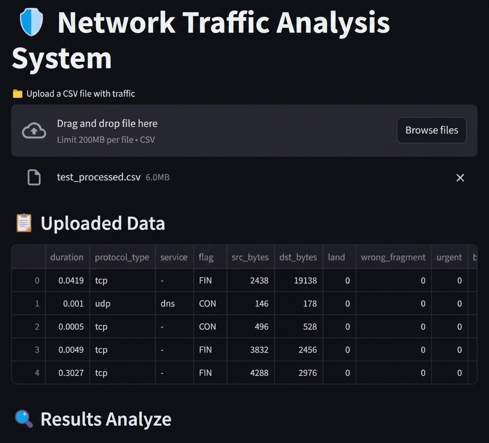
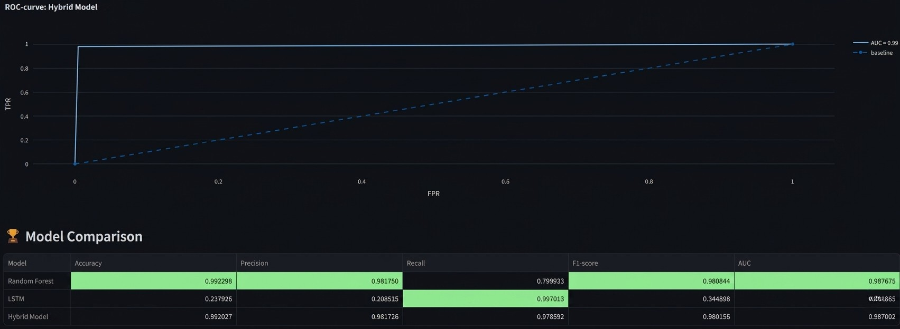

# Network Analyzer


Real-time network intrusion detection system combining LSTM-based sequence analysis with Random Forest classification for anomaly detection in network traffic.

## Overview

Hybrid AI-based intrusion detection system designed for real-time network traffic analysis and anomaly detection using LSTM and Random Forest models.

Developed as part of MSc Computer Science research focused on AI-driven cybersecurity systems.

## Features

* Hybrid LSTM + Random Forest detection pipeline
* Real-time traffic monitoring dashboard
* PCAP traffic analysis and feature extraction
* Streamlit-based visualization interface
* Ensemble anomaly scoring system
* Network traffic simulation and evaluation tools

## Tech Stack

* Python
* TensorFlow / Keras
* Scikit-learn
* Scapy
* Pandas / NumPy
* Streamlit

## Experimental Results

| Metric    | Score  |
| --------- | ------ |
| Accuracy  | 99.20% |
| Precision | 93.7%  |
| Recall    | 93.1%  |
| F1 Score  | 93.4%  |

## Dashboard Preview

### Traffic Analysis



### Model Evaluation



## Documentation

* [Research Summary](./docs/research-summary.md)
* [System Architecture](./docs/architecture.md)

## Running Locally

```bash
pip install -r requirements.txt
streamlit run app.py
```

## Disclaimer

This project was developed for educational and research purposes.
